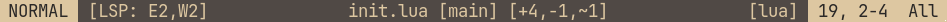

# yasl.nvim

Yet another ***minimal and lightweight*** statusline plugin for neovim.

## Examples


## Installation
Using Lazy:
```lua
{
    "brianaung/yasl.nvim",
    config = function()
        require("yasl").setup()
    end
}
```

## Configuration
### Sections layout
```
+------------------------------------+
| a | b |        | c |       | d | e |
+------------------------------------+
```

### Default configuration
See [here](https://github.com/brianaung/yasl.nvim/blob/main/lua/yasl/default.lua).
```lua
require("yasl").setup({
    -- Default options
    global = true, -- show single statusline for all files
    sections = {
        -- all available modules
        a = { components = { "mode" } },
        b = { components = { "diagnostics" } },
        c = { components = { "filename", "branch", "gitdiff" } },
        d = { components = { "filetype" } },
        e = { components = { "location", "progress" } },
    }
})
```

### Custom highlights
```lua
require("yasl").setup({
    -- provide custom highlights
    sections = {
        -- see :h nvim_set_hl() to see the {val} format
        a = { 
            components = { "mode" }, 
            highlight = { fg = "#202020", bg = "#7daea3" },
        },
        ...
    }
}
```
