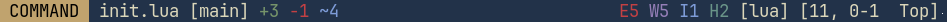

# yasl.nvim

Yet another ***minimal and lightweight*** statusline plugin designed for neovim. It prioritizes simplicity and performance without sacrificing functionality.

## Features
In addition to easy integration with vim's default statusline items, *YASL* provides the following features:
- **LSP Diagnostics**: Keep track of **lsp diagnostic** informations
- **Git Informations**:
    - Display the current branch name
    - Show git diff stats to stay informed about changes
- **Active Mode**: Easily identify the currently active mode with dynamic colors
- **Custom Components**: Create your own custom providers with simple recipe.

These features are available without relying on any extra dependencies. It also tries to be more efficient by evaluating each statusline component only when needed, preventing unnecessary and expensive function calls.

## Examples





## Installation
Using Lazy:
```lua
{
    "brianaung/yasl.nvim",
    config = function()
        require("yasl").setup() -- call this to enable plugin
    end
}
```

## Configurations
### Available components
- [mode](https://github.com/brianaung/yasl.nvim/blob/main/lua/yasl/builtins/mode.lua)
- [diagnostics](https://github.com/brianaung/yasl.nvim/blob/main/lua/yasl/builtins/diagnostics.lua)
- [branch](https://github.com/brianaung/yasl.nvim/blob/main/lua/yasl/builtins/branch.lua)
- [gitdiff](https://github.com/brianaung/yasl.nvim/blob/main/lua/yasl/builtins/gitdiff.lua)
- Your own custom component. See [recipe](#recipe-for-creating-your-own-component).
- Any valid string used by vim's statusline items. See `:h statusline`.

### Default options
```lua
require("yasl").setup({
    -- Use global statusline. See :h laststatus
    global = true,

    --[[
    Accepts provided component name (or)
    any string vim can use for statusline value. See :h statusline

    Default layout:
    +--------------------------------------------------------------------+
    | mode | name branch diff |             | diagnostics | ft, loc prog |
    +--------------------------------------------------------------------+
    ]]--
    components = {
        "mode",
        " ",
        "%<%t%h%m%r%w", -- filename
        " ",
        "branch",
        " ",
        "gitdiff",
        "%=",
        "diagnostics",
        " ",
        "%y",
        " ",
        "[%-8.(%l, %c%V%) %P]", -- filetype, location, and progress
        " ",
    }
})
```

### Recipe for creating your own component
To provide your own custom components, simply pass in a table to `components` array
with `events` and `update` values set.

```lua
require("yasl").setup({
    ...
    components = {
        ...
        {
            -- Events that will trigger update function calls and redraws the statusline.
            events = { "BufEnter" },
            -- Any function that returns a string value.
            update = function()
                return "Hello!"
            end
        },
        ...
    },
    ...
})
```
